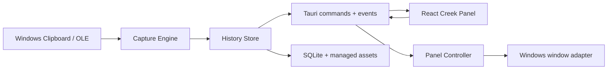

# ClipRaft MVP 实施计划

Status: in-progress
计划已获用户批准，正式项目名：ClipRaft。

计划版本：2026-09-02
实施门禁：已于 2026-09-02 获用户批准，允许本地初始化工程、引入依赖并编写产品代码。
版本控制：仅创建本地 Git 仓库和本地提交，不配置 remote，不执行 `git push`。

## 1. 交付目标

交付一个 Windows 10 22H2 / Windows 11 x64 的本机剪贴板浮窗原型：它常驻托盘并吸附在单显示器左侧或右侧；复制文本、图片或文件后保存一张剪贴卡片，并以不抢焦点的两秒复制预览回应；用户可以搜索、固定、恢复、自动粘贴、拖入、拖出和软删除卡片。

视觉必须忠实于已批准的 `.impeccable/mocks/creek-c-meander.png`：展开宽度目标为 190–210 logical px，主体是留白充分的夏日小溪，小型厚木筏承载不同模态，底部控制码头与最后一张卡片保持距离。删除、替换或去重后，下方木筏沿浅弧线向上游补位。

首版完成的判定不是“窗口能打开”，而是从系统复制到捕获、存储、展示、恢复和再次粘贴的完整闭环可证明工作。

## 2. 已冻结的产品规则

- 一次复制动作对应一张剪贴卡片；卡片有一个主要模态，但可保留纯文本、HTML、RTF、位图和文件列表等多个原始表示。
- 未固定的重复内容不新建卡片，而是刷新原卡片并移动到历史流顶部；固定卡片不因重复内容重排。
- 文件默认只保存来源路径；用户执行“保留副本”后才把实体复制进受管目录。
- 历史保留开启时使用持久 SQLite；关闭时新内容只进入内存数据库和临时资源目录。旧持久历史不删除，重新开启后恢复显示；当前会话内容不自动迁入持久历史。
- 未固定历史默认保留 200 张或 30 天；受管资源上限 1GB。固定卡片不参与自动清理。
- 拖到垃圾区为软删除，提供 5 秒撤销；删除固定卡片前二次确认。
- 单击选择；双击或 Enter 恢复内容并按设置决定是否自动粘贴；另有只复制、不粘贴的明确操作。
- MVP 只支持当前单显示器，不做云同步、账户、OCR、AI 分类、Board、插件、遥测、自动更新或 Microsoft Store。

## 3. 技术基线与复用边界

### 直接复用

从 EcoPaste 固定提交 `5139d30b0f4c1309356a9b308c05092f1038bc9b` 选择性移植 Apache-2.0 代码和实现思路：

- `clipboard-rs` 监听薄封装、Windows 剪贴板延迟读取与重试；
- `ClipboardPayload → ingest → upsert → event` 管线；
- `sqlx` migration、FTS5 查询和内容 hash 去重；
- 图片按内容摘要外置、数据库只保存相对路径的存储方式；
- 文件拖出使用 `drag` crate，文本/HTML/RTF 拖出使用 Windows OLE `IDataObject`。

移植以本项目的数据模型和深模块 interface 为准，不整仓搬运。所有复制的代码保留 Apache-2.0 版权信息，在 `THIRD_PARTY_NOTICES.md` 记录来源文件、固定提交和本地修改。

### 只学习，不复制

- Ditto：学习 Windows 多格式、隐私标志、延迟读取、去重排序和 OLE delayed rendering；GPL-3.0 源码不进入仓库。
- PasteBar：学习历史流和拖放反馈；自定义许可证源码不进入仓库。

### 首版刻意不引入

- 不引入状态管理库：React `useReducer` 和 Tauri event 足够。
- 不引入动画库或物理引擎：FLIP + Web Animations API/CSS 完成木筏漂流。
- 不引入 `dnd-kit`：没有自由排序需求，原生 drag event 加 Rust OS drag-out 足够。
- 暂不引入虚拟列表：上限仅 200 张；先用图片懒加载和 overscan 验证，只有性能门禁失败才加 `react-virtuoso`。
- 不引入通用 UI 组件库：批准稿需要专用材料语言，通用卡片组件反而会增加覆盖成本。

实施前只对实际要安装的新依赖做一次健康检查：许可证、最近发布、最近提交、Windows 支持和采用度。使用 Tauri 官方插件优先于自写系统集成。

## 4. 架构与深模块

### Capture Engine

这是隔离 Win32/clipboard-rs 复杂度的深模块。interface 只暴露 `start(event_sink)`、`stop()` 和 `restore(payload)`；实现内部负责监听、去抖、重试、隐私格式检查、读取多个原始表示、归一化和来源识别。调用者永远不接触 Windows format handle。

### History Store

这是数据真实性和生命周期的深模块。interface 暴露 `ingest(capture)`、`query(criteria)`、`get_restore_payload(id)` 和 `act(command)`；`command` 覆盖固定、软删除、撤销、保留副本和清理。实现内部负责事务、hash 去重、FTS、持久/会话模式、资源引用和清理。SQLite 使用临时数据库做真实测试，不额外建立只有一个实现的 repository trait。

### Panel Controller

这是纯状态机深模块。`transition(state, event) -> state + effects` 处理 `Collapsed`、`Peeking`、`Open`、`PinnedOpen`；复制事件只产生无焦点预览 effect，显式点击/快捷键才允许取得焦点。Windows adapter 只执行定位、显示、焦点和 always-on-top effect，不承载业务规则。

### React Creek Panel

React 只消费稳定的 DTO 和命令，不读取数据库路径，也不调用 Win32。历史流状态使用一个 reducer；文本、图片、文件木筏共享选择、键盘、拖拽和操作壳，只替换内容 surface。生产素材拆成可复用的水面/岸线、木筏壳、石头控件和底部码头，不把整张桌面视觉稿作为应用背景发货。

## 5. 最小数据模型

- `clips`：ID、内容 hash、主要模态、预览文本、创建/最近使用时间、固定状态、软删除时间和来源摘要。
- `representations`：所属卡片、表示类型、内联文本或受管资源相对路径、尺寸和必要元数据。
- `file_entries`：文件列表中的原路径、可选保留副本路径、存在状态和基础文件元数据。
- `settings`：历史保留、自动粘贴、启动项、停靠边缘、偏移和面板固定状态。
- `clips_fts`：仅索引可搜索文本和文件名，由 migration 中的 trigger 保持同步。

图片和保留副本不存数据库 blob。写入流程先产生临时文件，数据库事务成功后原子改名；失败时回收临时文件，避免孤儿资源。清理先软删除记录，撤销窗口结束后再删除无引用资源。

## 6. 实施阶段与验收门禁

### 阶段 0：本地仓库与最小骨架

初始化本地 Git `main`，不添加 remote；验证提交身份后按 Conventional Commits 提交。创建 Tauri v2 + React 19 + TypeScript 骨架、Rust workspace、SQLite migration 目录、许可证/来源登记和最小 CI 等价本地命令。

完成证据：开发窗口可启动；Rust tests、TypeScript typecheck 和前端 build 为空功能通过。

### 阶段 1：文本捕获纵切片

先打通一条最短真实路径：Windows 复制纯文本 → Capture Engine → History Store → Tauri event → 临时列表 → 恢复到系统剪贴板。实现多表示数据结构，但本阶段只交付文本表示。

完成证据：自动化测试覆盖去重、固定不重排和恢复；Notepad 到应用再回 Notepad 的手工闭环通过。

### 阶段 2：SQLite、搜索与多模态

加入 migration、FTS5、持久/会话数据库切换、图片外置存储、文件列表和“保留副本”。实现 200 张/30 天/1GB 清理规则，并尊重 Windows 排除监控和历史标志。

完成证据：文本、HTML/RTF、图片、单/多文件路径往返；Unicode 路径、失效路径、重复图片和数据库升级测试通过；关闭历史保留后重启不出现会话内容，旧持久历史仍在。

### 阶段 3：边缘窗口与焦点契约

实现托盘、单实例、全局快捷键、左右停靠、DPI/work-area 定位和四态 Panel Controller。复制只显示两秒 Copy Peek，不能改变前台窗口；点击、悬停或 `Win+Alt+V` 打开完整面板，关闭行为为隐藏到托盘。

完成证据：自动复制预览期间连续键入不会中断；快捷键打开后键盘导航有效；100%/125%/150% DPI 下窗口不越过工作区。

### 阶段 4：批准稿静态还原与核心操作

先按 Impeccable comp-spec 把批准稿拆成可发货素材和语义层，再实现小溪、三种木筏、搜索石、底部码头、选中/悬停/焦点/空状态。文本和按钮保持真实 DOM，装饰栅格不承担文字或命中区域。

完成证据：批准尺寸和常见桌面高度截图对比通过；全键盘可操作；对比度、焦点环和 Windows reduced-motion 设置可识别。

### 阶段 5：恢复、自动粘贴与拖拽

实现复制按钮、双击/Enter、自动粘贴开关、拖入创建、文件/文本/HTML/RTF 拖出、拖到垃圾区软删除、5 秒撤销、固定删除确认和保留副本。

完成证据：Explorer、Notepad 和至少一个富文本应用完成拖入/拖出/粘贴矩阵；自动粘贴只发给打开面板前记录的有效前台窗口，失败时安全降级为“已复制”。

### 阶段 6：漂流动效、性能与无障碍

使用 FLIP 计算删除、替换和去重后的旧/新位置；木筏以 transform/opacity 沿浅弧线上游补位，420–560ms，24–36ms 错峰，总延迟不超过 120ms。重复动作从当前视觉位置重定向，不排队；减弱动态时改为 120–160ms 淡变和不超过 4px 位移。

完成证据：200 张记录下展开、滚动和连续删除保持流畅；隐藏窗口停止非必要水面动画；键盘和减弱动态路径不依赖位移动画表达状态。

### 阶段 7：生命周期、打包与验收

补齐设置、开机启动默认关闭、托盘退出、崩溃后资源扫描、便携包和安装包。执行 Windows 10/11、DPI、路径、权限、睡眠恢复和资源上限验收矩阵。

完成证据：本地安装/卸载和便携运行通过；无网络请求、无遥测、无配置 remote；变更日志、第三方声明、架构文档和最终截图齐全。

## 7. 性能与可靠性预算

- 复制事件到 Copy Peek 可见：暖机后 p95 不超过 250ms。
- 快捷键到面板可交互：暖机后 p95 不超过 180ms。
- 200 张历史首次查询：不超过 100ms；普通搜索不超过 100ms。
- 可见木筏的补位以 60Hz 为目标；任何时候只动画可见项和少量 overscan。
- 数据库写入、受管资源写入和恢复操作必须返回结构化错误；系统剪贴板繁忙时进行有上限的退避重试，不能无限阻塞 UI。
- 自动粘贴失败不得丢失内容：恢复剪贴板成功后，即使发送粘贴键失败，也保留“内容已复制”的可见结果。

## 8. 测试策略

- Rust interface 测试：捕获归一化、hash/去重、持久/会话切换、清理、软删除/撤销和 Panel Controller 状态转换。
- SQLite 临时库集成测试：migration、FTS trigger、事务失败和资源引用回收；不 mock SQL。
- Windows 串行集成测试：文本、图片、文件列表和 OLE 恢复；测试进程自行写入并读取系统剪贴板，避免并行污染。
- React 只测试 reducer 和关键键盘行为；视觉正确性由获批稿截图差异、真实 Tauri 窗口和人工可用性检查负责。
- 每个阶段必须同时给出自动化命令和至少一个真实 Windows 交互证据，不能用静态 mock 代替系统闭环。

## 9. 主要风险与处理

- **焦点被抢**：Panel Controller 与 Windows adapter 分离；Copy Peek 窗口始终 non-activating，验收以实际前台 HWND 和连续键入为准。
- **WebView 透明窗口性能**：小溪只占窄窗口，滤镜和水纹限制在局部；优先预渲染可循环素材，避免全窗实时 shader。
- **OLE 拖出复杂**：先移植 EcoPaste Apache 实现；文本/HTML/RTF 和文件分别验收，不尝试首版支持任意私有格式拖出。
- **路径失效或资源丢失**：路径卡片明确显示失效状态；“保留副本”采用原子写和内容 hash；恢复失败不删除历史。
- **许可证污染**：只有 EcoPaste permissive 代码可复制；Ditto、PasteBar 和 CopyQ 只保留链接与行为笔记。
- **视觉稿像壁纸而不是插件**：生产窗口不包含桌面、任务栏或图标；小溪边缘必须能独立覆盖任意壁纸。

## 10. 本地提交规划

计划批准后按可运行纵切片提交，不按文件类型提交：

1. `chore: scaffold local tauri workspace`
2. `feat: capture and restore text clipboard entries`
3. `feat: persist multimodal clipboard history`
4. `feat: add non-activating edge panel shell`
5. `feat: build creek history interface`
6. `feat: add paste drag delete and undo actions`
7. `feat: add retention settings and cleanup`
8. `test: verify windows packaging and acceptance flows`

每个提交前运行与该阶段对应的最小证明；不 amend，不创建远端，不 push。发现无法与用户已有修改隔离的脏工作树时停止并报告。

## 11. 审核点

批准本计划意味着允许：初始化本地 Git、搭建工程、安装计划内且健康检查通过的依赖、选择性移植 EcoPaste Apache-2.0 代码、生成/拆分本地 UI 素材、运行测试和创建本地提交。

批准不意味着允许：配置远端、上传仓库或素材、`git push`、创建 GitHub PR/Issue、发布安装包到互联网，或加入 MVP 范围外功能。
